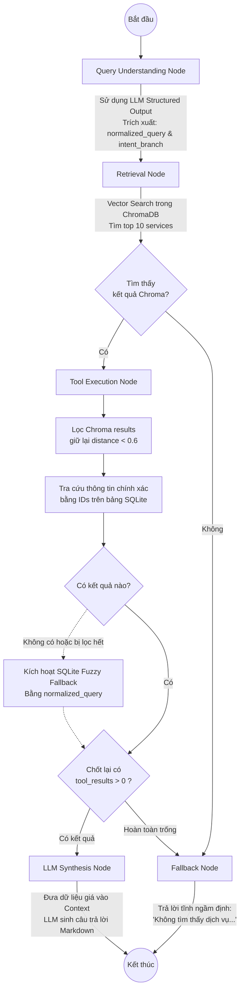

# Vinmec AI Chatbot Flow (Dựa trên Code thực tế)

Dựa trên việc đọc mã nguồn trong thư mục `backend/app/graph` (`builder.py`, `nodes.py`), luồng hoạt động (flow) **thực tế hiện tại** của hệ thống được lập trình bằng LangGraph như sau:

## Nhận xét độ chênh lệch so với bản thiết kế (SPEC.md):
1. **Không có luồng Async cho Khẩn cấp:** Codebase hiện tại chưa có "nghe lén khẩn cấp" để đưa ra số 115. Chỉ là một pipeline tuần tự duy nhất.
2. **Không có bước "Clarification" (hỏi lại):** Đồ thị thay vì phân nhánh dựa trên Confidence Score thì phân nhánh hoàn toàn vào số lượng document lấy được (`retrieved_services > 0` và `tool_results > 0`). Nếu không thỏa mãn, nó sẽ đưa về một trạng thái Fallback nói câu xin lỗi cố định.
3. **Chưa có Feedback Loop ở Backend:** Vòng lặp nhận structured feedback và cập nhật Golden Dataset chưa xuất hiện trong định nghĩa biểu đồ hay State của LangGraph.
4. **Fallback Fuzzy Search:** Code thực tế có thêm một cơ chế dự phòng hay. Nếu ChromaDB trả về tàng hình hoặc bị lọc hết do distance quá xa (>0.6), hàm `fallback_fuzzy_search` bên SQLite sẽ được gọi tiếp để vớt vát kết quả.
