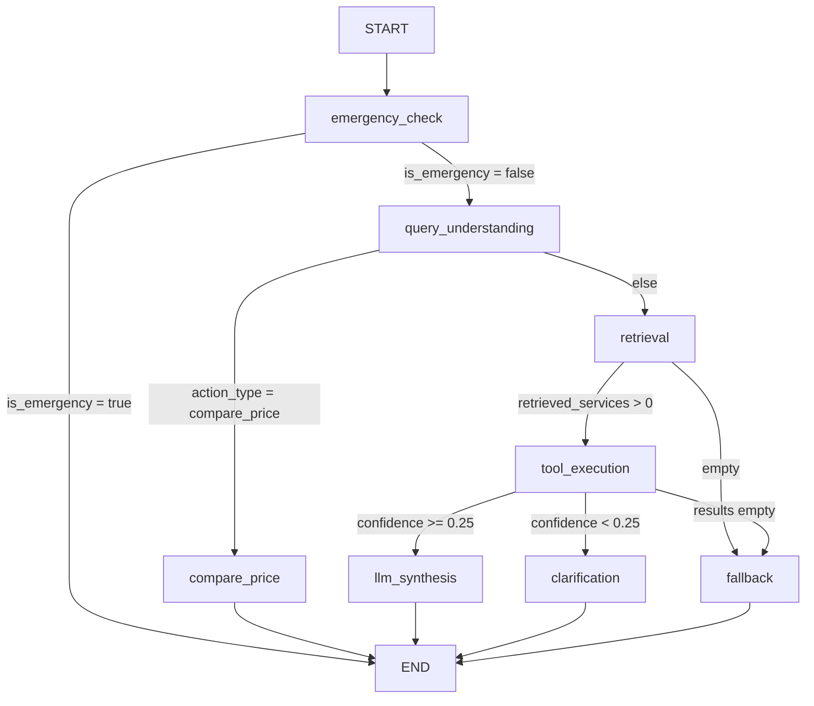

# Vinmec AI Chatbot Flow (Kiến trúc LangGraph V2)

Dựa trên việc cập nhật mã nguồn theo chuẩn **Clean Architecture** tại thư mục `backend/app/graph/`, luồng hoạt động (flow) thực tế của hệ thống đã được thiết kế tinh vi hơn và hoạt động đúng chuẩn một trợ lý Triage (Sàng lọc y tế) với các thao tác như Phân loại khẩn cấp, So sánh giá, và Đặt câu hỏi làm rõ.

## Các Bước Tiến Lớn Ở Bản V2:
1. **Có Luồng Khẩn Cấp Chặn Đầu (`emergeny_check`):** Nếu khách gõ các câu từ "chảy máu", "cấp cứu", luồng đi thẳng vào **END** với số 115 mà không mất tiền chạy LLM phân tích nhảm.
2. **Khả Năng So Sánh Chủ Động (`compare_price`):** Người dùng yêu cầu so sánh giá lập tức rẽ nhánh qua Node lập bảng đa chi nhánh.
3. **Cơ Chế Kháng Ảo Giác (`clarification`):** Tool Execution được bổ sung bộ quy tắc chấm điểm `confidence_score`. Nếu dưới mức ranh giới 25%, AI sẽ chủ động rẽ sang nhánh `Clarification` nhún nhường hỏi thêm thông tin (VD: "bạn muốn siêu âm thái 4D hay 2D") thay vì trả lời bừa gây ảnh hưởng thương hiệu y tế. 
4. **Clean Architecture Isolation:** Thay vì cuộn một cục lớn thì biểu đồ đồ thị (`builder.py`) được map 1-1 với từng file thực thể trong `nodes/` riêng lẻ, giúp tách rời các lớp giao tiếp Service và Database.
